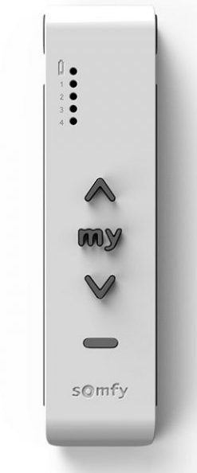
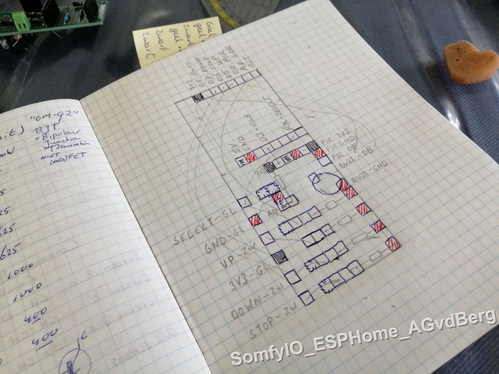

# SomfyIO ESPHome HomeAssistant
Personal project to automate screens using SomfyIO protocol

Using a Somfy remote connected to an ESP8266 with ESPHome software we can now control the Somfy screens of the house.

<div align="center">
  <kbd>
    
  </kbd>
</div>

## Description

Somfy (screens) have [two communication protocols](https://www.somfy.nl/over-somfy/technologieen-en-compatibiliteit); RTS using RFX-433,92 Mhz and [IO-homecontrol](https://www.somfy.nl/ondersteuning/somfy-motoren/io-homecontrol) using encrypted communication. When I bought my screens I choose SomfyIO. My house has three screens; each with it's own remote.
Currently it is not possible to communicate directly (to pretend using a remote).

With the help of may examples but most important [Beejayf's project SomfyDuino on Hackster.io](https://www.hackster.io/beejayf/somfyduino-io-3d8283) I bypassed the protocol using an original 4-channel-remote.
The way it works is that pussing a button on the remote is faked by connecting wires to the remote-buttons.
The wires are reused from an old desktop-PSU; enough wires combined in a bundle.

I had a WemosD1 mini pro laying around so it could be connected to some IO-pins of this ESP8266 board.
ESPHome is used to program the ESP; it was easy to implement and has OTA (Over The Air) updates.

In my house I plan to put a domotica-sensor in each room, so I add some other sensors to the ESP; light-resistor, an RGB-led, PIR and a buzzer.

Using ESPHome on the ESP has the advantage it is easy connected to my domotica-software HomeAssistant. In HomeAssistant I made some automations and scripts to push a message to the ESP. 

------------------------

## Setup

### Needed hardware

- Somfy remote 				(like the Somfy SITUO 5 IO Pure)
- cable with 6 wires		(i cut it from an old Desktop-PSU)
- ESP8266 or ESP32    		(like the WemosD1 mini Pro)
- [ESPHome software](https://esphome.io/)  		(to program the ESP8266)
- [HomeAssistant software](https://www.home-assistant.io/)	(to control the screens, on any hardware)
- Solder board, tin, solder iron
- 4 200 Ohm resistors
- 4 small & simple LED's 
- 6 wire connectors with screw (to connect the cable to the solderboard)
- extra hardware like an LDR, RGB-led, PIR and buzzer are optional off course


### Before soldering

You must program the Somfy remote before taking it out of the case and doing any soldering.
Program the remote to use your screens according to the manual.
Now the remote is communicating to the right screen.
You can use the fysical buttons 'channel', 'up', 'down' and 'my'/stop
The 'program'-button on the back of the remote is not connected and not usable after soldering


### The correct remote

The old remote, the Somfy SITUO 5 IO Pure is easier to solder wires to.
The new remote has smd components were soldering wires is more advanced
The remote had 4 channels. There are SMD-leds on the remote (on th eleft upper corner) to give information which screen is adressed.
My 3 screens are each equiped with an SITUO 1 IO Pure-remote, for each room. They are not used in this project.

------------------------

### The way it works

The way the remote is used is to simulate a button press (and let the remote do all the srambled communications)
The button press is simulated by connecting the 'copper circle' to ground.
On the remote-board the dot in the middle of the copper circle is connected to ground
That means on no-press the pin connected to the copper circle must kept high
I use a high resistor (including a small blue led) to connect the high-pin to ground. It draws only a few mA.
My ESP is connected to normal 230V->5V plug so i don't need to care about draining any battery.
Extra bonus is that i see on the blue led if the pinout is high or low.


### Pictures of the remote

<div align="center">
  <kbd>
    
  </kbd>
    
  Somfy SITUO 5 IO Pure
</div>

<div align="center">
  <kbd>
    
  </kbd>
    
  Back of the remote: Somfy Situo 5 io Pure
</div>

<div align="center">
  <kbd>
    
  </kbd>
    
  Remote unpacked from case
</div>

<div align="center">
  <kbd>
    
  </kbd>
    
  Remote with soldered wires
</div>

<div align="center">
  <kbd>
    
  </kbd>
    
  Newest remote has SMD = much harder to solder
</div>


### Prototype board with WemosD1 mini Pro

- ESP8266
- Wifi-access
- Enough IO-ports

------------------------

### Connections 

#### Somfy connections

| Somfy remote  | ESP - WemosD1 mini Pro |
|---------------|------------------------|
| Battery(+)    | 3V3                    |
| Battery(-)    | GND                    |
| "SELECT"      | GPIO03 = RX            |
| "UP"          | GPIO14 - D5            |
| "My" / Hold   | GPIO12 - D6            |
| "DOWN"        | GPIO13 - D7            |
 
 Hardware each pin is 'active high' and not only connected to somfy but also by small blue LED and 200 Ohm resistor to GND
 In ESPHome each the four pins gets a switch, each switch becomes a button
 By activating the button the pin & switch is set low for 500ms and then set high again...thus simulating a short hardware button press on the remote
 In HomeAssistant we see all switches and buttons
 

### ESPHome software for the somfy remote

The WemosD1 mini pro with ESP8266-chip has ESPHome firmware installed
Pins are connected to a 'switch' and made into a 'button'
Furthermore ESPHome gives extra information like uptime and wifi information

Initialization part to display nice names ESPHome -> HomeAssistant -> user
```
substitutions:
  devicename: Somfy
```


Part to make switch connected to hardware pin
```
switch:
- platform: gpio
  pin: 3  #GPIO3 / RX - connected to Somfy CHANNEL
  id: pin3
  restore_mode: ALWAYS_ON   # start HIGH
- platform: gpio
  pin: 14  #GPIO14 / D5 - connected to Somfy UP
  id: pin14
  restore_mode: ALWAYS_ON   # start HIGH
- platform: gpio
  pin: 12  #GPIO12 / D6 - connected to Somfy STOP
  id: pin12
  restore_mode: ALWAYS_ON   # start HIGH
- platform: gpio
  pin: 13  #GPIO13 / D7 - connected to Somfy DOWN
  id: pin13
  restore_mode: ALWAYS_ON   # start HIGH
```

and
```
# switch functionality
# LED is on if switch is turned off !
- platform: template
  name: ${devicename} CHANNEL-RX-GPIO3  # change name later to functionality
  optimistic: yes
  id: pinnetje3
  turn_on_action:
  - switch.turn_off: pin3   # negative: pin=off => output=low (=> test-led=off)
  turn_off_action:
  - switch.turn_on: pin3    # pin=on => output=high  (=> test-led=on)
- platform: template
  name: ${devicename} UP-D5-GPIO14   # change name later to functionality
  optimistic: yes
  id: pinnetje14
  turn_on_action:
  - switch.turn_off: pin14   # negative: pin=off => output=low (=> test-led=off)
  turn_off_action:
  - switch.turn_on: pin14    # pin=on => output=high  (=> test-led=on)
- platform: template
  name: ${devicename} STOP-D6-GPIO12   # change name later to functionality
  optimistic: yes
  id: pinnetje12
  turn_on_action:
  - switch.turn_off: pin12   # negative: pin=off => output=low (=> test-led=off)
  turn_off_action:
  - switch.turn_on: pin12    # pin=on => output=high  (=> test-led=on)
- platform: template
  name: ${devicename} DOWN-D7-GPIO13   # change name later to functionality
  optimistic: yes
  id: pinnetje13
  turn_on_action:
  - switch.turn_off: pin13   # negative: pin=off => output=low (=> test-led=off)
  turn_off_action:
  - switch.turn_on: pin13    # pin=on => output=high  (=> test-led=on)

```

Emulate a button
 - conform [explanation in ESPHome documentation](https://esphome.io/components/button/index.html)
 
```
# button functionality
# Button is pushed low for 0,5 sec
button:
  - platform: template
    name: ${devicename} Button-CHANNEL-RX-IO3
    id: wemosd1_rx_button
    icon: "mdi:gesture-tap-button"
    on_press:
      - logger.log: "Knop CHANNEL ingedrukt = output RX even LOW = CHANNEL"
      - switch.turn_off: pin3   # negative: pin=off => output low
      - delay: 500ms 
      - switch.turn_on: pin3    # pin=on => output high
  - platform: template
    name: ${devicename} Button-UP-D5-IO14
    id: wemosd1_d5_button
    icon: "mdi:gesture-tap-button"
    on_press:
      - logger.log: "Knop UP ingedrukt = output D5 even LOW = UP"
      - switch.turn_off: pin14   # negative: pin=off => output low
      - delay: 500ms 
      - switch.turn_on: pin14    # pin=on => output high
  - platform: template
    name: ${devicename} Button-STOP-D6-IO12
    id: wemosd1_d6_button
    icon: "mdi:gesture-tap-button"
    on_press:
      - logger.log: "Knop STOP ingedrukt = output D6 even LOW = STOP"
      - switch.turn_off: pin12   # negative: pin=off => output low
      - delay: 500ms 
      - switch.turn_on: pin12    # pin=on => output high
  - platform: template
    name: ${devicename} Button-DOWN-D7-IO13
    id: wemosd1_d7_button
    icon: "mdi:gesture-tap-button"
    on_press:
      - logger.log: "Knop DOWN ingedrukt = output D7 even LOW = DOWN"
      - switch.turn_off: pin13   # negative: pin=off => output low
      - delay: 500ms 
      - switch.turn_on: pin13    # pin=on => output high
```

------------------------

#### OPTIONAL - Other connections - This has nothing to do with the Somfy Screens

The other perifials have nothing to do with the Somfy Screens.
They are added by me to support extra information, room sensors and/or just for fun.
+ RGB Led
+ Internal Led
+ LDR - light resistor
+ PIR - Motion sensor
+ Buzzer


##### ==> RGB LED (PL9823)

| RGB LED (PL9823)            | ESP - WemosD1 mini Pro |
|-----------------------------|------------------------|
| (short) pin 1 Data In (DI)  | TGPIO00 = D3           |
| (short) pin 2 V+ (5V)       | 5V                     |
| (long)  pin 3 GND           | GND                    |
| (long)  pin 4 Data Out (DO) | not connected          |

 - has chipset WS2811
 - In ESPHome 'fastled_clockless' & old framework 2.7.3 needed  (see code)
 
code in ESPHome:
```
esp8266:
  board: d1_mini_pro

  # Special downgrade to support fastled_clockless for RGBled PL9823
  # see https://esphome.io/components/light/fastled.html
  framework:
    version: 2.7.4  

light:
  # RGB led PL9823
  - platform: fastled_clockless
    chipset: WS2811
    pin: D3  # GPIO0 = D3 (FLASH)
    num_leds: 1
    rgb_order: RGB
    name: ${devicename} RGBled
```

##### ==> Internal LED (in WemosD1 mini Pro)

 - connected to GPIO02 = D4
 - because we can use it
 - extra possibility to test function 'Home Assistant switch' 
 - also used to give startup information, before connection to HomeAssistant is established

code in ESPHome:
```
esphome:
  name: wemosd1-somfy

  # do something on boot -> Blink two times
  # default priority = 600 => most sensors are set up. Before 250 = Wifi is initialized
  on_boot:
    then:
      - switch.turn_on: internal_pin    # turn on = inverted pin = on => led=on
      - delay: 500ms 
      - switch.turn_off: internal_pin   # turn off = inverted pin = off => led=off
      - delay: 500ms 
      - switch.turn_on: internal_pin    # turn on = inverted pin = on => led=on
      - delay: 500ms 
      - switch.turn_off: internal_pin   # turn off = inverted pin = off => led=off
      - delay: 500ms 

switch:
- platform: gpio
  pin: 
    number: 2 #GPIO2 / D4 is internal_led_pin
    inverted: true     # output low = pin off = led ON
  id: internal_pin
  restore_mode: ALWAYS_OFF   # start low = pin on = led OFF

```
 
##### ==> LDR - resistor

Connections:
```
   +------ 3V3
   |
   R = 20kOhm
   |
   +------ pin A0   (Analog input)
   |
   LDR
   |
   +------ GND
```

 - This is a voltage-divider. Max input of A0 is 1V

code in ESPHome:
```
sensor:
  - platform: resistance
    sensor: somfy_a0_sensor
    configuration: DOWNSTREAM    ## LDR is connected to GND, UPSTREAM if connected to VCC
    resistor: 20.0kOhm
    name: ${devicename} LDR
    
  # Analog input from LDR
  - platform: adc
    id: somfy_a0_sensor
    pin: A0
    update_interval: 10s
    name: ${devicename} A0 reading
```

##### ==> PIR Motion sensor 

| PIR             | ESP - WemosD1 mini Pro |
|-----------------|------------------------|
| pin 1 UI = OUT  | GPIO16 = D0            |
| pin 2 GND       | GND                    |
| pin 3 VCC       | 3V3                    |

code in ESPHome:
```
binary_sensor:
  # PIR motion detection
  - platform: gpio
    pin: D0   # GPIO16 = D0
    name: ${devicename} Motion
    device_class: motion
```


##### ==> Buzzer
 
| PIR         | ESP - WemosD1 mini Pro |
|-------------|------------------------|
| positive    | GPIO15 = D8            |
| negative    | GND                    |

- passive buzzer
- connected to software PWM on ESP
- with the ESPHome-code there is a function-call ('service') generated in HomeAssistant which can play RTTTL-songs
- mainly used to give a beep on start- and endpoint of the 'screen-down' and 'screen-up' scripts

code in ESPHome
```
# Software-PWM on D2 for passive buzzer
output:
  - platform: esp8266_pwm
    pin: D8
    id: rtttl_out

# RTTTL = Ring Tone Text Transfer Language
# see https://esphome.io/components/rtttl.html
rtttl:
  output: rtttl_out
  on_finished_playback:
    - logger.log: 'Song ended!'

# Generate API (for HomeAssistant) to play a 'song'/melody/tone
api:
  services:
    - service: play_rtttl
      variables:
        song_str: string
      then:
        - rtttl.play:
            rtttl: !lambda 'return song_str;'

```

------------------------

### HomeAssistant code

#### Entities from ESPHome device visable in HomeAssistant

By using ESPHome these entities are available in HomeAssistant:
```
# The pins
  - switch.somfy_channel_rx_gpio3
  - switch.somfy_down_d7_gpio13
  - switch.somfy_stop_d6_gpio12
  - switch.somfy_up_d5_gpio14

# The buttons
  - button.somfy_button_channel_rx_io3
  - button.somfy_button_down_d7_io13
  - button.somfy_button_stop_d6_io12
  - button.somfy_button_up_d5_io14
```

The other sensors as entities
```
# Internal LED
  - button.somfy_iled
  - switch.somfy_internal_led_2
# RGBLed
  - light.somfy_rgbled
# LDR
  - sensor.somfy_a0_reading
  - sensor.somfy_ldr
# PIR
  - binary_sensor.somfy_motion
  
# Wifi information
  - sensor.somfy_connected_ssid
# Other Device Info
  - sensor.somfy_ip_address
  - sensor.somfy_wifi_signal
  - sensor.somfy_latest_scan
  - sensor.somfy_mac_wifi
  - sensor.somfy_esphome_version
  - sensor.somfy_uptime
  - sensor.somfy_uptime_human_readable
  - sensor.uptime_human_readable
  - button.somfy_esphome_restart_device

# Connected? (used in automations)
  - binary_sensor.somfy_status
```

<b>To test en low level control the communication:</b>
Remember: you have to see the on board LEDs to get feedback and to see it's working

<div align="center">
  <kbd>
    
  </kbd>
    
  See if the connection is ok  (in wifi-range?)
  My language is Dutch
</div>

```
type: entity
entity: binary_sensor.somfy_status
state_color: true
```


<div align="center">
  <kbd>
    
  </kbd>
    
  Control ESP-pins high/low
</div>

```
type: entities
entities:
  - entity: switch.somfy_internal_led_2
  - entity: switch.somfy_channel_rx_gpio3
    name: pin CHANNEL
  - entity: switch.somfy_up_d5_gpio14
    name: pin UP
  - entity: switch.somfy_stop_d6_gpio12
    name: pin MY
  - entity: switch.somfy_down_d7_gpio13
    name: pin DOWN
```


<div align="center">
  <kbd>
    
  </kbd>
    
  Simulate button push
</div>

```
type: glance
show_name: true
show_icon: true
show_state: false
entities:
  - entity: button.somfy_button_channel_rx_io3
    name: CHANNEL
  - entity: button.somfy_button_up_d5_io14
    name: UP
  - entity: button.somfy_button_stop_d6_io12
    name: MY
  - entity: button.somfy_button_down_d7_io13
    name: DOWN
```

#### Scripts to control the screens

I added some comment code to explain, which will not last in yaml->UI conversion in HomeAssistant.
Almost the same script is made to control all my three screens.

```
alias: SOMFY 1 screen down
sequence:
  # Function: play a beep on the buzzer; easy signal for me testing it by standing next to the device
  - service: script.somfy_play_double_beep
    data: {}
  - delay:
      hours: 0
      minutes: 0
      seconds: 1
      milliseconds: 0
	  
  # simulate two presses of the CHANNEL button, first is activation, second changes from 'ALL' to the first channel/screen.
  - repeat:
      count: 2
      sequence:
        - service: button.press
          data: {}
          target:
            entity_id: button.somfy_button_channel_rx_io3
			
		# Every time one second delay to give the device time & to follow it during testing. Speed isn't an issue here.
        - delay:
            hours: 0
            minutes: 0
            seconds: 1
            milliseconds: 0
			
  # Simulate the DOWN button press
  - service: button.press
    data: {}
    target:
      entity_id: button.somfy_button_down_d7_io13
  - delay:
      hours: 0
      minutes: 0
      seconds: 1
      milliseconds: 0
	  
  # simulate five CHANNEL-button presses to get back to the 'ALL' position
  - repeat:
      count: '5'
      sequence:
        - service: button.press
          data: {}
          target:
            entity_id: button.somfy_button_channel_rx_io3
        - delay:
            hours: 0
            minutes: 0
            seconds: 1
            milliseconds: 0

  # Play a double beep on the buzzer to hear that the script is ready			
  - service: script.somfy_play_double_beep
    data: {}
mode: single
icon: mdi:archive-arrow-down

```

By the way; the double beep is activated with this script:
```
alias: SOMFY Play double beep
sequence:
  - service: esphome.wemosd1_somfy_play_rtttl
    data:
      song_str: two short:d=4,o=5,b=100:16e6,16e6
mode: single
icon: mdi:cellphone-sound

```

#### Active scripts from HomeAssistant

We can put the scripts on the HomeAssistant (lovelace) screen:

<div align="center">
  <kbd>
    
  </kbd>
    
  Push-button to activate a script
</div>

```
show_name: true
show_icon: true
type: button
tap_action:
  action: toggle
entity: script.somfy_screen_1_down
show_state: true
name: Script Screen 2 DOWN
```

or.... with custom:button-card  (see [Github](https://github.com/custom-cards/button-card) a changeble script
 - we change the script to run depending on its state
 - state is defined with a 'boolean-helper'
 - therefore update of this boolean-helper must be added to all scripts
 - for nice and easy looking we change the icon, name and color depending on its state
But you can figure this out yourself

<div align="center">
  <kbd>
    
  </kbd>
    
  Advanced push buttons
</div>

```
type: custom:button-card
name: Screen 1
entity: input_boolean.somfy_screen_1_down
tap_action:
  action: call-service
  service: script.turn_on
  service_data:
    entity_id: |
      [[[
        if (entity.state == 'on')
          return "script.somfy_screen_1_up";
        else
          return "script.somfy_screen_1_down";
      ]]]
state:
  - value: 'off'
    icon: mdi:archive-arrow-up-outline
    name: 1 is open
    styles:
      icon:
        - color: lightgray
  - value: 'on'
    name: 1 is closed
    styles:
      icon:
        - color: magenta
```

Or... all screens at once

<div align="center">
  <kbd>
    
  </kbd>
    
  Active all screens at once
</div>

```
type: custom:button-card
entity: binary_sensor.somfy_status
icon: mdi:archive-arrow-up-outline
name: ALL-UP
tap_action:
  action: call-service
  service: script.turn_on
  service_data:
    entity_id: script.somfy_1_2_3_up
styles:
  icon:
    - color: white
  name:
    - font-size: 12px
    - color: white
state:
  - value: 'on'
    styles:
      icon:
        - color: yellow
  - value: 'off'
    styles:
      icon:
        - color: red
```


#### Automating screen movement

To turn the screens automaticly down we use the binary_sensor which we defined earlier. It is a combination of all the factors to determen if we want the screens down in the first place.

##### Simplified / basic automation

This is the basic automation; if the boolean-helper is true the script is run.
We include a delay of 2 minutes to prevent fast down and up - commands; 'Family Acceptance Factor'
The automation also checks if the hardware is available, in which case a message to my mobile is stated in stead

```
alias: SCREENS Down
trigger:
  - platform: state
    entity_id:
      - binary_sensor.screen_wanted_down
    to: 'on'
    for:
      hours: 0
      minutes: 2
      seconds: 0
	  
action:
  - if:
	  # We can only activate if we have a working connection
      - condition: state
        entity_id: binary_sensor.somfy_status
        state: 'on'
    then:
      - service: script.somfy_1_2_3_down
        data: {}
    else:
      - service: notify.mobile_app_mymobile
        data:
          title: Screens unavailable
          message: >-
            Connection with SomfyWemos is lost so can't change screen position
mode: single
```


##### Extended / full automation

In real live i made the automation much complexer. 
 - prevent real change in case of test
 - turn RGB light on the the device according to its status
 - selective 'turn of automation' for the family in a boolean-helper

What i didn't do:
<b>multi-script prevention</b>
I choose not to combine the down- and up-scripts, in fact combine ALL the scripts in to one big script. It can be a solution to prevent scripts to fast operating, or even simultaneously. To program that will be to time consuming for the perpose of my single house. And there are limits for the booleans that can not result in taking place within the minute. I think. When it fails i should fix it by putting it all back in to the good position using manual override.


DOWN

```
alias: SCREENS Down
trigger:
  - platform: state
    entity_id:
      - binary_sensor.screen_wanted_down
    to: 'on'
    for:
      hours: 0
      minutes: 2
      seconds: 0
	  
# extra helper to show on dashboard and prevent double-tab	  
condition:
  - condition: state
    entity_id: input_boolean.screen_down
    state: 'off'
	
action:
  - if:
	  # We can only activate if we have a working connection
      - condition: state
        entity_id: binary_sensor.somfy_status
        state: 'on'
    then:
	
	  # Turn RGB led in color magenta
      - service: light.turn_on
        data:
          rgb_color:
            - 171
            - 5
            - 204
        target:
          entity_id: light.somfy_rgbled
		  
	  # Set helper
      - service: input_boolean.turn_on
        data: {}
        target:
          entity_id: input_boolean.screen_down
		  
	  # Play extra beep on device
      - service: script.somfy_play_double_beep
        data: {}
		
	  # Test mode available, also used to 'turn of automation' for the family	
      - if:
          - condition: state
            entity_id: input_boolean.somfy_real_change
            state: 'on'
        then:

		  # Special operation: only screens 1 and 3 and leave screen 2 alone...special script needed
          - if:
              - condition: state
                entity_id: binary_sensor.screen_ignore_screen2
                state: 'on'
            then:

			  # Put all the screens down
              - service: script.somfy_1_2_3_down
                data: {}
				
			  # And notify me on my mobile... still testing phase
              - service: notify.mobile_app_mymobile
                data:
                  title: Screens down
                  message: >-
                    ALL screens down at {{ states('sensor.datetime_formatted') }}.
            else:
			
			  # Special script: only screens 1 and 3 down
              - service: script.somfy_1_3_down
                data: {}

			  # And notify me on my mobile... still testing phase
              - service: notify.mobile_app_mymobile
                data:
                  title: Screens 1+3 down
                  message: >-
                    Screens 1+3 down at {{ states('sensor.datetime_formatted') }}
        else:
		
		  # It is a test; no screens touched, only message to my phone
          - service: notify.mobile_app_mymobile
            data:
              title: Screen TEST down
              message: at {{ states('sensor.datetime_formatted') }}.
    else:
	
	  # Somfy / ESPHome / ESP-device not available
      - service: notify.mobile_app_mymobile
        data:
          title: Screens NOT down
          message: >-
            Connection with SomfyWemos lost so no change DOWN at {{ states('sensor.datetime_formatted') }}.
mode: single
```


<b>Result = move screen(s) by HomeAssistant when needed</b>


### What doesn't work / Known issues

#### No Feedback
This whole project has one drawback; there is no feedback.
Off course we can see or hear the status and change of the screens when we are at home.
The remote has four leds indicating which screen/channel is about to adressed.
Pressing the 'Channel'-button changes the channel from 1 to 2 to 3 to 4 to 'ALL' and back to 1.

#### Channel to be adressed
Sometimes the remote is reset. And sometimes a pulse is generated. In testing fase this resulted sometimes to move one screen down. In the middle of the night. Of the master bedroom. So much for 'Family Acceptance Factor'.
My solution was to set the default channel to "ALL". In my house we have three screens and I do not have all the screens adressed to the 'ALL'-changes. If in any case a 'down'-command is generated non of my screens listen.

#### Manual control of the screens
My using the normal remote the screens can be changed in position. The project and HomeAssistant have no way to know what the position of the screen is.
This is realy not a big problem; on a 'down' command when the screen is already down it does nothing and doesn't smoke.

#### Is the command well deployed?
Without feedback we can only assume (and test) if the command is resulting in the correct effect.
One solution in my software (in HomeAssistant) is to always put the channel of the remote in the 'ALL' position. With a command to put a screen down i allways switch the channels like it is in the 'all' position.
So to move for screen 3 i always start by 'pushing' the channel button four times  (first one is to activate the remote, learned by testing).
Another solution is to put a webcam (like one of the ESP32-CAM's i have laying around here) on the screen. But i am not fond on putting a camera in a bedroom. Nor does my partner ;-) 
The current workaround is to periodically check the status of the remote, if it is in the 'ALL'-position. The result when it is not that the wrong screen or no screen is moved at command.
The way to fix a situation; push the digital 'Channel' button a few times, while watching the hardware and the visable SMD-leds. So tip when building a 3D-case: let the SMD-leds on the remote be visable.

## Development to a working situation

### Breadboard try-out

- install everything on a breadboard
- add software on ESP and automations in HomeAssistant

<div align="center">
  <kbd>
    
  </kbd>
    
  Breadboard with somfy-wire-connectors already removed
</div>


### Update to prototype board

- plan
<div align="center">
  <kbd>
    
  </kbd>
    
  Layout of prototype board
</div>

 - components, ESP removable
<div align="center">
  <kbd>
    
  </kbd>
    
  Prototype board with ESP
</div>

<div align="center">
  <kbd>
    
  </kbd>
    
  Prototype board without ESP
</div>

<div align="center">
  <kbd>
    
  </kbd>
    
  Back of prototype board 
</div>
 
### Troubleshooting

 - screen down after power loss: default at 'all channels'
 - connection lost; LDR=0 -> Calculated Lux=MAX -> trouble with graphics

------------------------

## Back matter

### Legal disclaimer

Usage of this description for attacking targets without prior mutual consent is illegal. It is the end user's responsibility to obey all applicable local, state, and federal laws. Developers assume no liability and are not responsible for any misuse or damage caused by this description.

### Acknowledgements

Thanks to all who helped inspire this project

### See also

- Beejayf's project SomfyDuino
     - [on arduino.cc](https://create.arduino.cc/projecthub/beejayf/somfyduino-io-3d8283)
	 - [on Hackster.io](https://www.hackster.io/beejayf/somfyduino-io-3d8283)
- [Tim Alston on twitter (only some pictures)](https://mobile.twitter.com/TimAlston/status/1340330866023813120)
- [Mention on dutch 'Tweakers' forum of Beejayf's SomfyDuino](https://gathering.tweakers.net/forum/list_messages/1982854)
- [First try and asking for help of Celaeno1 & Hakan using OpenHab](https://community.openhab.org/t/solved-somfy-io-rollershutter-motors-which-system-is-best-for-using-with-oh2/81929/12)
- [Github repro of smslabsbr for SomfyRTS](https://github.com/dmslabsbr/esphome-somfy)
- [Github repro of imicknl for connection with the use of Tohama](https://github.com/imicknl/ha-tahoma)


### To-do in this Github explaination

- [x] pinout connection 
- [x] ESPHome code
- [x] References to found examples
- [x] more explaining code, readable story to new user
- [x] add home assistant code & screens
- [ ] ~~upload yaml files~~  i use edited sections to be an example
- [ ] share this github on social media: twitter, reddit, HA-forum
- [ ] share dutch version on [personal website (dutch)](www.ecozonnewoning.nl)

### To-do

- [x] Working with a prototype-board
- [ ] ~~Redesign and use an dedicated pcb~~
- [ ] ~~Temperature & Humidity sensor~~
- [ ] Design and print a nice 3D case


### License

This project is licensed under the [MIT License](LICENSE.md).

## Acknowledgments

Inspiration, code snippets, etc.
 * [README copied from Michael Stickels README template](https://github.com/MichaelStickels/README_Template)
 * [Adapted from TINY README](https://gist.github.com/noperator/4eba8fae61a23dc6cb1fa8fbb9122d45)

